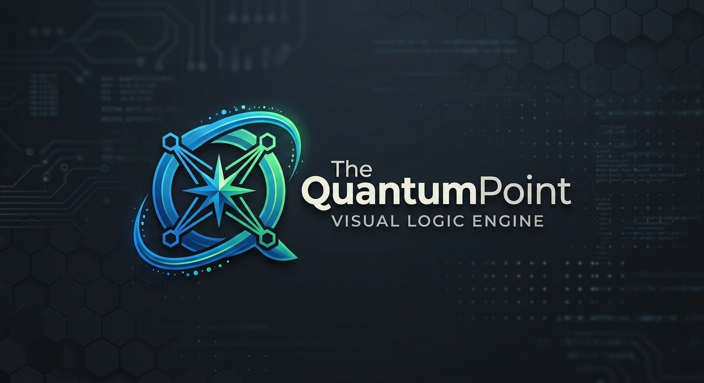

<p align="center">
  
</p>

# Quantum Point

<p align="center">
  <strong>Version 0.0.0.2</strong> · <a href="LICENSE">MIT</a>
</p>

A visual programming environment — graph → universal IR → native code. This is not a generic “no-code” builder: the focus is **data-oriented design** (DOD), **binary** project files (`.qp`), and a **domain-separated** pipeline (Core / View / Bridge).

---

## Goals

| Goal | Description |
|------|-------------|
| **Visual logic** | Backend (Core), UI (View), and I/O (Bridge) on separate graph layers |
| **Universal IR** | **Run** does not pick a language first — it validates `ir::Program` |
| **Multiple targets** | **Build** emits Rust, WASM, View spec, and Bridge artifacts |
| **Native performance** | Core graphs compile to binaries via Rust (and future emitters) |
| **Binary format** | Projects are not JSON — `QPGR` / `QPRJ` / `QPME` + postcard |

---

## Current status (v0.0.0.2)

Core pipeline is **product-ready** for visual backend logic; View and advanced Bridge integrations continue on the roadmap.

| Ready | Beta / next |
|-------|-------------|
| Core: Start, Log, Assign, If, While, For, **Foreach**, Return, Break, Continue, Expr, **Switch** (dynamic cases), **Try**, **Async** (tokio emit), **DB Read** (mock tables) | Subgraph wizard, real SQL |
| Run → IR + `qp-runtime` preview | View canvas ↔ runtime positions |
| Build → Rust + sandbox cargo (+ tokio when graph uses Async) | axum Bridge option |
| Bridge: stdlib HTTP on `127.0.0.1:8787` | Event wiring Core ↔ Bridge |
| Studio + CLI + binary `.qp` | full wasm-bindgen |
| View Runtime (egui) | |

Details: [docs/ROADMAP.md](docs/ROADMAP.md) · architecture: [docs/ARCHITECTURE.md](docs/ARCHITECTURE.md)

---

## Quick start

**Requirements:** Rust stable, Cargo.

```bash
git clone https://github.com/TwelfthLLC/TheQuantumPoint.git
cd TheQuantumPoint
cargo run -p nocode-app
```

On **Linux**, install GUI deps once (eframe / winit):  
`sudo apt-get install -y libgtk-3-dev libxcb-render0-dev libxcb-shape0-dev libxcb-xfixes0-dev libxkbcommon-dev libssl-dev`

Release build (faster UI):

```bash
cargo run -p nocode-app --release
```

### Studio

| Screen / control | Purpose |
|------------------|---------|
| **Launcher** | Create and open projects |
| **Graph** (View layer) | Nodes and wires |
| **View Runtime** (top bar) | Live UI preview |
| **▶ Run** | Universal check (IR / domain), no cargo |
| **Build** | Target language → emit + toolchain |
| **Build & Run** | Core: `cargo run` |

### CLI

```bash
cargo run -p nocode-cli -- run examples/hello-rust/graphs/main.qp
cargo run -p nocode-cli -- build examples/hello-rust/graphs/main.qp
cargo run -p nocode-cli -- exec examples/hello-rust/graphs/main.qp
```

---

## Pipeline

```
.qp graph → compile (domain) → ir::Program     ← Run
          → emit-rust | emit-view | emit-wasm   ← Build
          → cargo / artifacts
```

**Core** nodes: `start`, `log`, `assign`, `if`, `while`, `for`, `return`, `switch`, `break`, `continue`, `try`, `expr`, `async`, `db_read` (beta), `subgraph_call` (beta).

---

## Project layout

```
graphs/*.qp              # QPGR v2 — nodes, wires, layer
quantum-point.qp         # QPRJ — manifest
.nocode/build/           # sandbox output (gitignored)
```

Example: `examples/hello-rust/`

Branding assets: [`assets/branding/`](assets/branding/)

---

## Crates

| Crate | Role |
|-------|------|
| `graph-model` | `.qp` codec, `DataValue` |
| `qp-domain` | Core / View / Bridge |
| `compiler` | Graph → IR |
| `ir` | Universal IR |
| `qp-runtime` | IR preview (Run) |
| `qp-view-runtime` | View egui runtime |
| `emit-rust` / `emit-wasm` / `emit-view` / `emit-bridge` | Target emitters |
| `nocode-core` | Pipeline, sandbox, projects |
| `nocode-app` | egui Studio |
| `nocode-cli` | `qp` CLI |

---

## CI (GitHub Actions)

On every `push` and `pull_request`, these run separately on **Ubuntu**, **Windows**, and **macOS**:

| Job | Task |
|-----|------|
| **fmt** | `cargo fmt --all -- --check` |
| **clippy** | `cargo clippy --workspace --all-targets -- -D warnings` |
| **test** | `cargo test --workspace` |
| **build** | `cargo build --workspace --release` |

Total: 3 OS × 4 jobs = **12** parallel checks.

Workflow: [.github/workflows/ci.yml](.github/workflows/ci.yml)

After you push, open GitHub → **Actions** to see ✓ / ✗.

---

## Development

```bash
cargo test --workspace
cargo test -p graph-model write_workspace_example_binaries -- --nocapture
```

Crate versions in `Cargo.toml` use semver `0.0.1`; product version **`0.0.0.2`** — see [VERSION](VERSION).

---

## License

[MIT License](LICENSE) — © 2026 **Twelfth LLC** and Quantum Point contributors. Free to use with attribution.

---

## Contact

Repository: [github.com/TwelfthLLC/TheQuantumPoint](https://github.com/TwelfthLLC/TheQuantumPoint)  
Report bugs and suggestions via [GitHub Issues](https://github.com/TwelfthLLC/TheQuantumPoint/issues). The project is under active development.
